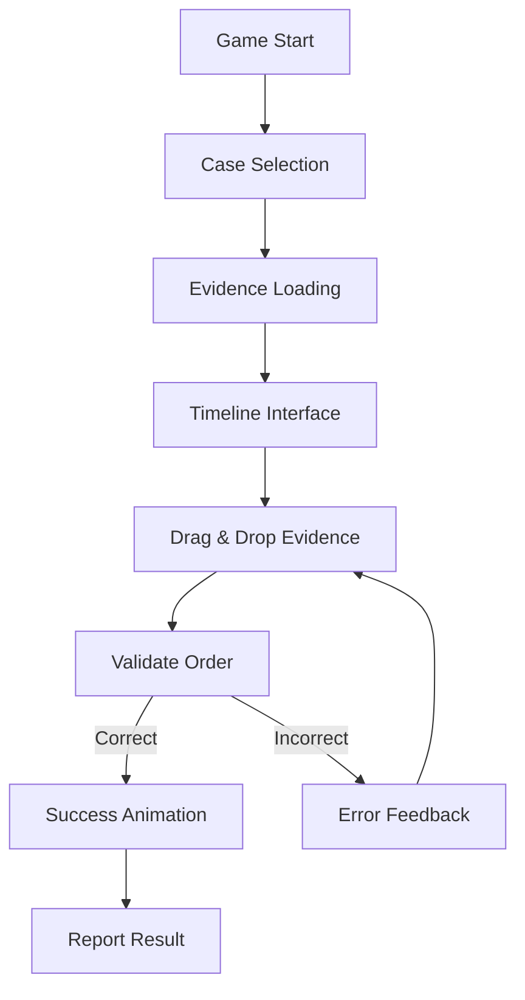

# Detective Timeline Puzzle Game - Architecture Document

## Overview

A mobile-first detective timeline puzzle mini-game where players drag and drop evidence cards to reconstruct the chronological sequence of events in murder mystery cases.

## Game Flow



## Data Schema Design

### Case Data Structure

```typescript
interface CaseData {
  evidence: Evidence[];
  gameSettings: GameSettings;
  evidenceTypes: EvidenceType[];
  exportDate: string;
  version: string;
}

interface Evidence {
  id: string;
  name: string;
  description: string;
  type: string;
  location?: string;
  imageUrl?: string;
  
  // Timeline fields
  timeHappened?: string;           // ISO 8601 format
  timeDiscovered?: string;         // ISO 8601 format
  timeHappenedAnchor?: boolean;    // Key timeline marker
  timeDiscoveredAnchor?: boolean;  // Key discovery marker
  timeHappenedDescription?: string;
  timeDiscoveredDescription?: string;
  
  // Game mechanics
  isHidden: boolean;               // false = main puzzle, true = advanced/hints
}

interface GameSettings {
  caseTitle: string;
  objective: string;
  questionType: "timeline";
  questionText: string;
  maxAttempts: number;
}

interface EvidenceType {
  id: string;
  name: string;
  color: string;                   // Tailwind classes
  defaultImageUrl?: string;
}
```

### Timeline Game Configuration

```typescript
interface TimelineGameConfig {
  selectedCase: string;            // Case file identifier
  difficulty: "easy" | "medium" | "hard";
  maxAttempts: number;
  showHints: boolean;
  timeLimit?: number;              // Optional time limit in seconds
}
```

## Evidence Selection Strategy

### Main Timeline (8-12 pieces)
- Filter evidence where `isHidden: false`
- Prioritize evidence with `timeHappenedAnchor: true` or `timeDiscoveredAnchor: true`
- Include mix of evidence types for visual variety
- Ensure chronological spread across the case timeline

### Difficulty Levels
- **Easy**: 6-8 evidence pieces, clear time gaps
- **Medium**: 8-10 evidence pieces, some close timestamps  
- **Hard**: 10-12 evidence pieces, complex overlapping times

## Mobile UI Design

### Evidence Card Component
```
┌─────────────────────────┐
│ [Type Badge]    [Icon]  │
│ Evidence Name           │
│ ─────────────────────── │
│ Brief description...    │
│ Location: Office        │
│ [Drag Handle]           │
└─────────────────────────┘
```

### Timeline Interface (Portrait Mode)
```
┌─────────────────────────┐
│     Case Title          │
├─────────────────────────┤
│ Evidence Pool           │
│ ┌─────┐ ┌─────┐ ┌─────┐ │
│ │Card1│ │Card2│ │Card3│ │
│ └─────┘ └─────┘ └─────┘ │
│ ┌─────┐ ┌─────┐         │
│ │Card4│ │Card5│         │
│ └─────┘ └─────┘         │
├─────────────────────────┤
│ Timeline (Drop Zone)    │
│ ┌─────────────────────┐ │
│ │ Earliest            │ │
│ │ ┌─────┐             │ │
│ │ │     │ Drop here   │ │
│ │ └─────┘             │ │
│ │ ┌─────┐             │ │
│ │ │     │             │ │
│ │ └─────┘             │ │
│ │ Latest              │ │
│ └─────────────────────┘ │
├─────────────────────────┤
│ [Check Order] [Reset]   │
└─────────────────────────┘
```

## Technical Implementation

### Core Components

1. **CaseLoader**: Loads and validates case data
2. **EvidenceCard**: Draggable evidence component
3. **TimelineZone**: Drop zone with validation
4. **GameState**: Manages attempts, scoring, hints
5. **ValidationEngine**: Checks chronological order

### Drag & Drop Implementation
- Use React DnD or native HTML5 drag/drop
- Touch-friendly for mobile devices
- Visual feedback during drag operations
- Snap-to-position in timeline zone

### Validation Logic

```typescript
interface TimelineValidation {
  isCorrect: boolean;
  errors: ValidationError[];
  score: number;
  hints?: string[];
}

interface ValidationError {
  evidenceId: string;
  expectedPosition: number;
  actualPosition: number;
  message: string;
}
```

### Validation Rules
1. **Primary Sort**: By `timeHappened` if available
2. **Secondary Sort**: By `timeDiscovered` if `timeHappened` is null
3. **Anchor Priority**: Evidence with `timeHappenedAnchor: true` must be correctly positioned
4. **Tolerance**: Allow minor timestamp differences (same day/hour)

## Game Mechanics

### Scoring System
- Base score: 100 points
- Deduct 10 points per incorrect placement
- Bonus points for perfect order on first try
- Time bonus (if time limit enabled)

### Feedback System
- **Correct Placement**: Green highlight, checkmark
- **Incorrect Placement**: Red highlight, position hint
- **Partial Credit**: Yellow highlight for close positions

### Hint System
- Show time ranges for evidence
- Highlight anchor evidence
- Reveal one correct position per hint

## Integration with Mini-Game Framework

### Configuration Schema Updates

```typescript
// system/configuration.ts additions
const timelineGameConfig = z.object({
  selectedCase: z.string(),
  difficulty: z.enum(["easy", "medium", "hard"]),
  maxAttempts: z.number().min(1).max(10),
  showHints: z.boolean(),
  timeLimit: z.number().optional(),
});
```

### Form Fields Updates

```typescript
// components/ConfigForm/formFields.ts additions
{
  key: "selectedCase",
  label: "Case File",
  type: "select",
  options: ["WongTimeline", "midnightOilTimeline2", "beaumontTimeline2"],
  required: true,
},
{
  key: "difficulty",
  label: "Difficulty Level",
  type: "select", 
  options: ["easy", "medium", "hard"],
  required: true,
},
{
  key: "maxAttempts",
  label: "Maximum Attempts",
  type: "number",
  min: 1,
  max: 10,
  required: true,
},
{
  key: "showHints",
  label: "Enable Hints",
  type: "checkbox",
  required: false,
}
```

### Result Actions

```typescript
// system/actions.ts additions
enum TimelineActions {
  Perfect = 'timeline-perfect',      // All correct on first try
  Success = 'timeline-success',      // Completed successfully
  Failed = 'timeline-failed',        // Exceeded max attempts
  Abandoned = 'timeline-abandoned',  // Player quit
}
```

## File Structure

```
system/
├── component.tsx              # Main game component (updated)
├── configuration.ts           # Config schema (updated)
├── actions.ts                # Result actions (updated)
├── case-loader.ts            # Case data loading utility
├── timeline-validation.ts    # Validation logic
└── game-state.ts            # Game state management

components/
├── EvidenceCard.tsx          # Draggable evidence card
├── TimelineZone.tsx          # Drop zone component
├── GameControls.tsx          # Check/Reset buttons
└── FeedbackDisplay.tsx       # Success/error messages

cases/
├── WongTimeline.json         # Existing case files
├── midnightOilTimeline2.json
└── beaumontTimeline2.json
```

## Development Phases

### Phase 1: Core Infrastructure
1. Update configuration schema
2. Create case loading system
3. Build basic evidence card component
4. Implement simple drag & drop

### Phase 2: Game Logic
1. Timeline validation engine
2. Game state management
3. Scoring and feedback system
4. Mobile-responsive design

### Phase 3: Polish & Testing
1. Visual feedback and animations
2. Hint system implementation
3. Test with all three case files
4. Performance optimization

## Mobile Optimization

### Touch Interactions
- Large touch targets (minimum 44px)
- Long press to start drag on mobile
- Visual feedback during drag operations
- Haptic feedback on successful drops

### Performance
- Lazy load case data
- Optimize image loading
- Minimize re-renders during drag operations
- Use CSS transforms for smooth animations

### Accessibility
- Screen reader support for evidence descriptions
- Keyboard navigation fallback
- High contrast mode support
- Focus management during drag operations

## Success Criteria

1. **Functional**: Players can successfully complete timeline puzzles for all three cases
2. **Mobile-First**: Smooth touch interactions on portrait mobile devices
3. **Engaging**: Clear visual feedback and satisfying completion experience
4. **Extensible**: Easy to add new case files with consistent data structure
5. **Integrated**: Properly reports results to parent game system

This architecture provides a solid foundation for building an engaging detective timeline puzzle that works seamlessly within the existing mini-game framework.